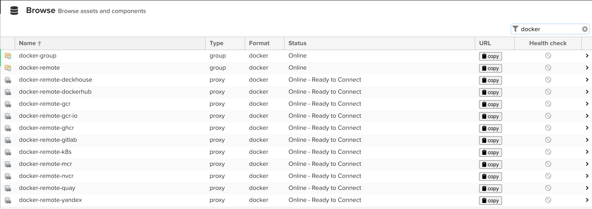
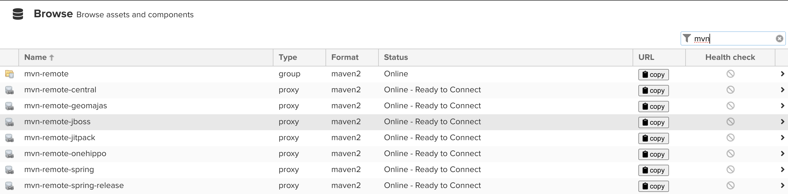
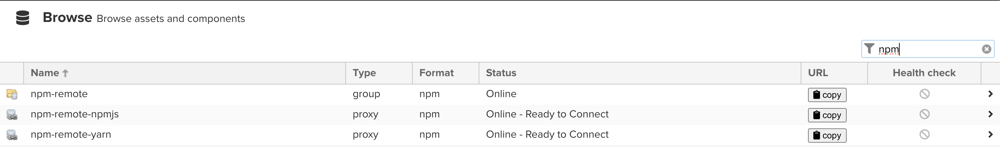

# Nexus mirroring configuration for development team

Nexus objects:

- Blob store
- Repository
- Group

Naming pattern

- tool-remote-short name, example docker-remote-dockerhub -> https://registry-1.docker.io

- docker
  
- gradle
- helm
- mvn
  
- npm
  
- nuget
- pip
- raw
- terraform

## For new mirrors look at ```variables.tf```

### Requirement Nexus url, username, password

[Terraform provider](https://github.com/datadrivers/terraform-provider-nexus)

```bash
export NEXUS_URL=https://nexus.example.com/
export NEXUS_USERNAME="admin"
export NEXUS_PASSWORD="password"
```
