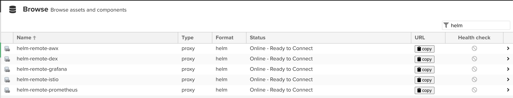
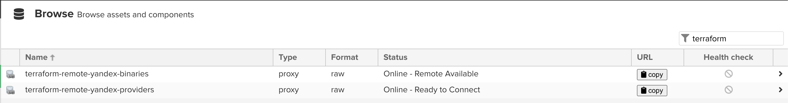

# Nexus mirroring configuration for development team

[Nginx Nexus configuration](https://github.com/a-langer/nexus-sso/tree/main/etc/nginx) for docker context path base routing

Nexus objects:

- Blob store
- Repository
- Group

Naming pattern

- tool-remote-short name for single repository, example docker-remote-dockerhub -> <https://registry-1.docker.io>
- tool-remote for group, example docker-remote -> includes all docker-remote-* repos

- docker
  
- gradle
- helm
  
- mvn
  
- npm
  
- nuget
- pip
- raw
- terraform
  

## For new mirrors look at ```variables.tf```

### Requirement Nexus url, username, password

[Terraform provider](https://github.com/datadrivers/terraform-provider-nexus)

```bash
export NEXUS_URL=https://nexus.dev.example.com/
export NEXUS_USERNAME="admin"
export NEXUS_PASSWORD="password"
```

#### Usage examples

1. Docker
   - docker pull via group

     ```bash
     docker pull nexus.dev.example.com/docker-remote/nginx:latest
     ```

   - docker pull directly via mirror

     ```bash
     docker pull nexus.dev.example.com/docker-remote-dockerhub/nginx:latest
     ```

1. Gradle
1. Helm

    - helm

      ```bash
      helm repo add mirror-prometheus https://nexus.dev.example.com/repository/helm-remote-prometheus
      ```

1. MVN

    - maven

      ```xml
      <settings xmlns="http://maven.apache.org/SETTINGS/1.0.0"
        xmlns:xsi="http://www.w3.org/2001/XMLSchema-instance"
        xsi:schemaLocation="http://maven.apache.org/SETTINGS/1.0.0 https://maven.apache.org/xsd/settings-1.0.0.xsd">
        <localRepository />
        <interactiveMode />
        <offline />
        <pluginGroups />
        <servers />
        <mirrors>
          <mirror>
            <id>dev-nexus</id>
            <name>Dev Nexus</name>
            <url>https://nexus.dev.example.com/repository/mvn-remote/</url>
            <mirrorOf>*</mirrorOf>
          </mirror>
          </mirror>
        </mirrors>
      </settings>
      ```

1. NPM
    - npm

      ```bash
      npm install --registry=https://nexus.dev.example.com/repository/npm-remote/
      ```

1. Nuget

    ```bash
    dotnet nuget add source https:///nexus.dev.example.com/repository/nuget-remote/index.json --name RemoteNuget --configfile ./nuget.conf
    ```

1. Pip

    - pip

      ```bash
      pip install --disable-pip-version-check --no-cache-dir -r requirements.txt --index-url https://nexus.dev.example.com/repository/pip-remote/simple
      ```

1. Raw
    - GitHub releases

      ```bash
      curl http://nexus.dev.example.com/repository/raw-remote-github/prometheus/node_exporter/releases/download/v1.8.1/node_exporter-1.8.1.darwin-amd64.tar.gz -o node_exporter-1.8.1.darwin-amd64.tar.gz
      ```

1. Terraform
    - .terraformrc file

      ```text
      provider_installation {
        network_mirror {
          url = "https://nexus.dev.example.com/repository/terraform-remote-yandex-providers/"
          include = ["registry.terraform.io/*/*"]
        }
        direct {
          exclude = ["registry.terraform.io/*/*"]
        }
      }
      ```

    - tfswitch

      ```bash
      tfswitch --mirror https://nexus.dev.example.com/repository/terraform-remote-yandex-binaries
      ```
